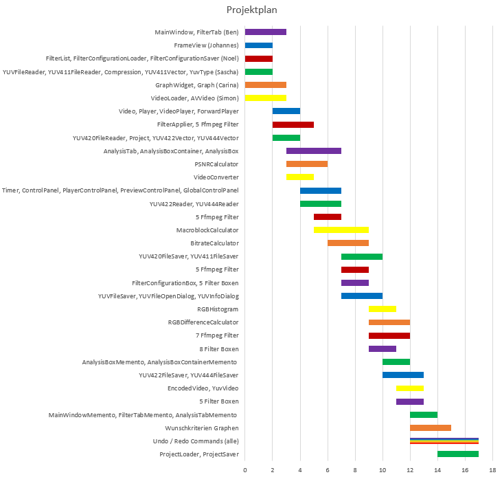

# Implementierung (Phase 3)
#### Phasenleiter: Johannes

## Coding style
Generell richten wir uns nach dem [Google C++ Style Guide](https://google.github.io/styleguide/cppguide.html).

Im folgenden sind die wichtigsten Regeln und Abweichungen aufgelistet.
### Naming conventions
#### Class Data Members
type prefix_camelCaseName_;

type camelCaseName_;

#### Memberfunction Names
type camelCaseName();

#### Static Memberfunction Names
static type CamelCaseName();

### Klassenschablone
class Name {

##### public:

&nbsp;&nbsp;&nbsp;static const data fields

&nbsp;&nbsp;&nbsp;static data fields

&nbsp;&nbsp;&nbsp;data fields

&nbsp;&nbsp;&nbsp;static memeber functions

&nbsp;&nbsp;&nbsp;default constructor

&nbsp;&nbsp;&nbsp;other constructors

&nbsp;&nbsp;&nbsp;copy constructor

&nbsp;&nbsp;&nbsp;move constructor

&nbsp;&nbsp;&nbsp;destructor

&nbsp;&nbsp;&nbsp;assignment operators

&nbsp;&nbsp;&nbsp;member functions

##### protected:

&nbsp;&nbsp;&nbsp;data fields

&nbsp;&nbsp;&nbsp;member functions

##### private slots:

&nbsp;&nbsp;&nbsp;member functions

##### private:

&nbsp;&nbsp;&nbsp;static const data fields

&nbsp;&nbsp;&nbsp;static data fields

&nbsp;&nbsp;&nbsp;data fields

&nbsp;&nbsp;&nbsp;member functions

}

### Sonstiges
Wann immer moeglich forward declarationen anstatt includes verwenden.

## Gangdiagramm

