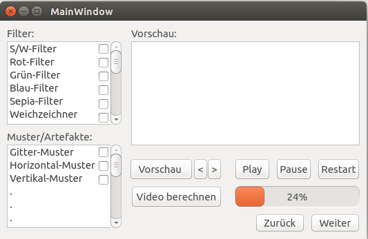

#7. Benutzungsoberfläche

## 7.1 Anforderungen

/B10/ Die Bedienungsoberfläche ist auf Mausbedienung ausgelegt, eine Bedienung ohne Maus muss dennoch möglich sein

/B20/ DIN 66234, Teil 8 ist zu beachten

/B30/ Die Benutzungsoberfläche besteht aus mehreren aufeinander folgenden Fenstern

/B40/ Die Größe der Fenster ist vordefiniert und kann nicht verändert werden

/B50/ Die Benutzungsoberfläche führt den Benutzer Schritt für Schritt durch das Programm

/B60/ Die Benutzungsoberfläche bietet jederzeit die Möglichkeit zu einem früheren Schritt zu springen

/B70/ Die Benutzungsoberfläche wird aus Elementen des Qt Designer aufgebaut 

## 7.2 Beispieldesign

### 7.2.1 1.Fenster(Encoderauswahl):

* "Öffnen" öffnet einen "Datei öffnen Dialog"

* Alternativ kann der Dateipfad manuell in das Textfenster eingegeben werden

* "Zuletzt verwendet" bietet eine Auswahl der kürzlich verwendeten Encoder

* "Weiter" bestätigt die Auswahl und wechselt zur Videoauswahl

### 7.2.2 2.Fenster(Videoauswahl):

* "Öffnen" öffnet einen "Datei öffnen Dialog"

* Alternativ kann der Dateipfad manuell in das Textfenster eingegeben werden

* "Zuletzt verwendet" bietet eine Auswahl der kürzlich verwendeten Videos

* "Weiter" bestätigt die Auswahl und wechselt zur Filter- und Musterauswahl

* "Zurück" wechselt zur Encoderauswahl

### 7.2.3 3.Fenster(Filter/Muster):

* "Filter" bietet die Möglichkeit einen Filter auszuwählen

* "Muster/Artefakte" bietet die Möglichkeit ein Muster oder ein Artefakt auszuwählen

* "Vorschau" berechnet 5 Vorschau Frames

* "<,>" bieten die Möglichkeit zwischen den Frames zu springen

* "Video berechnen" wendet die ausgewählten Filter/Muster auf das gesamte Video an

* "Play, Pause, Restart" bieten die Möglichkeit das berechnete Video abzuspielen

* "Weiter" bestätigt die Auswahl und wechselt zur Wiedergabe und Auswertung

* "Zurück" wechselt zur Videoauswahl

### 7.2.4 4.Fenster(Wiedergabe und Auswertung):

* "Play" Startet alle Videos

* "Pause" Pausiert alle Videos

* "Restart" Startet alle Videos neu

* "<" Springt bei allen Videos einen Frame rückwärts

* ">" Springt bei allen Videos einen Frame vorwärts

* "x1.0" zeigt die aktuelle Wiedergabegeschwindigkeit und bietet die Möglichkeit diese zu ändern

* "Differenz" zeigt Differenz oder Makroblöcke in dem Bereich oben rechts

* "Weitere Informationen" kann Metadaten etc. enthalten

* "Zurück" Wechselt zur Filter- und Musterauswahl

* "Encoder ändern" öffnet einen "Datei öffnen Dialog" um den neuen Encoder zu wählen und wechselt dann zu Fenster 3 (alte Auswahl bleibt erhalten)

